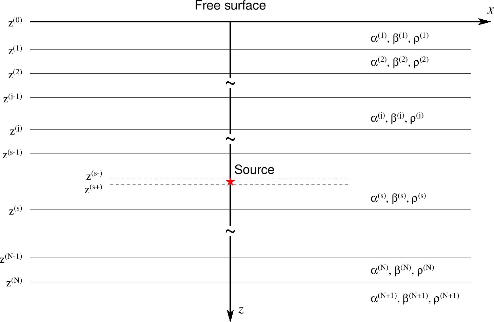
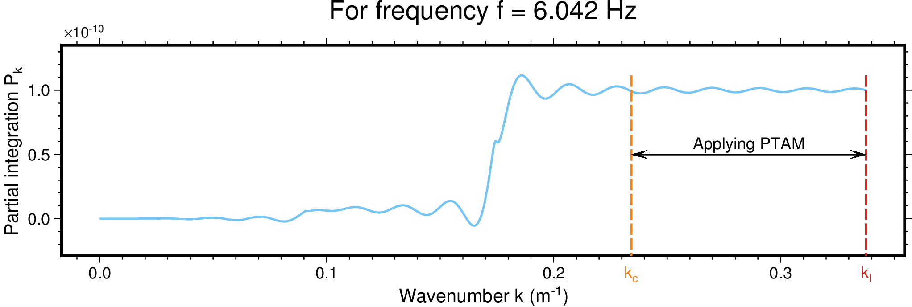
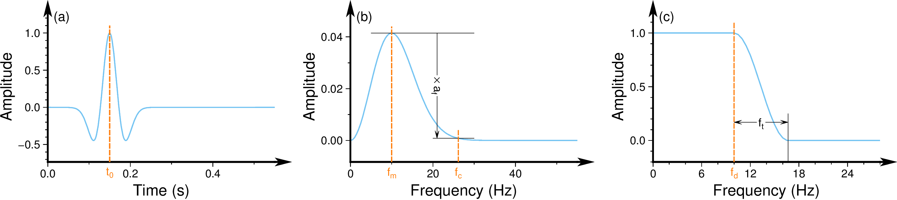
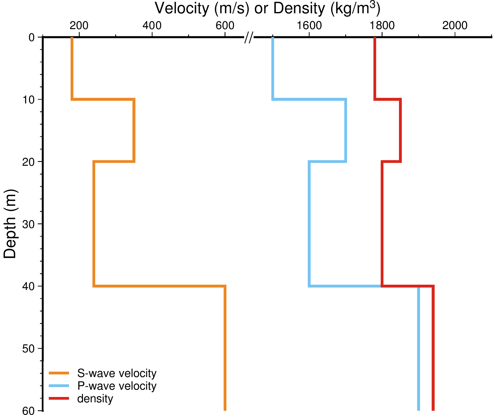

# LAC-GRTM

The Luco-Apsel-Chen generalized reflection/transmission coefficients method: synthetic seismogram calculation for a multi-layered half-space. 

## Repository

This repository is located at [https://github.com/GKIAN/LAC-GRTM](https://github.com/GKIAN/LAC-GRTM), and it's an implementation of LAC-GRTM (Chen, 1999) optimized with the peak-trough averaging method (Zhang et al., 2003) and improved by the method of Pei et al. (2008). Moreover, LAC-GRTM could be recast to calculate normal modes for multi-layered half-space (Chen, 1993).

## License

[The MIT License](LICENSE)

## Author

Tche Liu @ Xiaofei Chen Research Group

## Usage

There are four different second-level folders (SLFs) for different waveform calculating scenarios: (1) [GRTM-A2D](GRTM-A2D) for 2-D acoustic wave, (2) [GRTM-A3D](GRTM-A3D) for 3-D acoustic wave, (3) [GRTM-E2D](GRTM-E2D) for 2-D elastic wave and (4) [GRTM-E3D](GRTM-E3D) for 3-D elastic wave.

To use one of these calculators (or calculating programs), you should firstly enter the corresponding folder (SLF), and then compile the source files to generate it by `make`. If the compiling is successfully finished and the executable file **bin/grtcsgram** is generated, the following similar help information will be printed by `bin/grtcsgram -h` (an example for [GRTM-E3D](GRTM-E3D)):

```bash
[user@local LAC-GRTM/GRTM-E3D]$ bin/grtcsgram -h

Usage:
  bin/grtcsgram [inputFile]
               calculate 3-D elastic waveform for a point source (force/moment) in a multi-layer half-space.

  inputFile    the input configuring file. [default: input.conf]

```

>[!TIP]
>
>OpenMP has been used to accelerate the waveform calculating progress for all scenarios.

> [!NOTE]
>
> All these calculators are only suitable to calculate theoretical seismic (acoustic/elastic) waveforms for **a horizontal layered half-space model** (as shown in the following figure).



There will be two output text files for any one of these calculators, the displacement-component and traction-component output files marked by the filename extensions `.gu` and `.gt`, respectively. In both of the two output files, the first line is the directive information for every column. Starting from the second line, the first column gives the samples of the time axis and the other columns give the waveforms of all displacement/traction components.

### Setting in Makefile

Under these SLFs, `Makefile` is provided for compiling the correlative calculating program. The following text will take [GRTM-E3D/Makefile](GRTM-E3D/Makefile) as an example to explain the settings in the Makefile.

In the [Makefile](GRTM-E3D/Makefile), `FC` declares the compiler (including its path, only supporting `gfortran` or `ifort` at present), and `CLFS` could provide some extra compiling and linking options.

In the [Makefile](GRTM-E3D/Makefile), `FFTWPATH` sets the home directory of [the FFTW library](http://www.fftw.org). If no FFTW on your system, you could turn off the macro `FFTW` to replace functions in FFTW with the function `fft` in [utils/math.F90](utils/math.F90).

Besides, there are some available macro definitions for CPP preprocessing in the [Makefile](GRTM-E3D/Makefile):

- `STATIC`: to compile statically to generate position-independent executable file; otherwise, to compile dynamically.
- `DEBUG`: to generate debugging information and print checking parameters in the executable file; otherwise, to generate the fast-running executable file.
- `DOUBLETYPE`: to calculate in double-precision mode during simulation; otherwise, in single-precision mode.
- `FFTW`: to invoke the FFTW library deployed on your system to implement the FFT translation; otherwise, to invoke the function `fft` in [utils/math.F90](utils/math.F90).
- `IEEE`: to use the intrinsic module `ieee_arithmetic` for `inf` definition, which requires the compiler support; otherwise, to set manually `inf` value.
- `PeiDHS`: to use the modified GRTC method in Pei et al. (2008); otherwise, to use the original GRTC method in Chen (1999).
- `SH` (if it exits): to calculate SH wave propagation; otherwise, SH wave won't be considered.
- `PS` (if it exits): to calculate P-SV wave propagation; otherwise, P-SV wave won't be considered.
- `COLORPRINT`: to enable to print messages in color version (only for the terminal supporting colorful printing); otherwise, not in color version.
- `PROGBAR`: to show the calculating progress by the progress bar; otherwise, by the trivial printed text.

If turn on a macro, you should set it non-blank, such as `STATIC := ON`, adding any characters after `:=`; if turn off a macro, you should set it blank, such as `STATIC :=`, no any characters after `:=`.

### Configuring the input file

Under these SLFs, `demo` is provided to demonstrate how to use the correlative calculating program. There is an input configuring file `input.conf` under the directory `demo`. The following text will take [GRTM-E3D/demo/input.conf](GRTM-E3D/demo/input.conf) as an example to explain the parameters in the input file.

There are some configurable parameters for customized running in the [demo/intput.conf](GRTM-E3D/demo/input.conf):

- `OpenMP_num_threads`: the number of threads for OpenMP paralleling. If less than zero, the calculator will set the number to the system environment variable `OMP_NUM_THREADS`; if equal to zero, the number will be set to the number of processors that are available to the current device.
- `model_file`: the name of the model parameter file.
- `output_prefix`: the prefix of waveform output filenames. If there are any '@M' or '@C' in this string, all of these '@M' and '@C' will be replaced by the filenames (without extension) of the model parameter file and the input configuring file, respectively. After this replacement operation, this string will be used as the prefix of waveform output filenames.
- `transform_into_xyz` (if it exits): whether the output waveforms are transformed to the XYZ coordinate system from the RTZ coordinate system (T) or not (F). If not, the waveforms in the RTZ coordinate system will be output.
- `record_time_length`: the time length of the output waveform record.
- `record_time_step`: the step length of time $\Delta t$.
- `frequency_limit_amplitude_ratio`: the ratio of spectrum amplitude decay $a_f$ for limiting the highest desirable frequency $f_c$. The frequency $f_c$ will be determined as the maximum frequency at which the spectrum amplitude of source wavelet is not less than its maximum amplitude scaled by this value. Any frequencies larger than $f_c$ will not be considered during the waveform calculation. This value almost has no need to be changed; reduce it only if the high accuracy is necessary.
- `integrate_limit_k-step`: the step length of wavenumber for the discrete wavenumber integration (DWI). A suitable step length will be automatically calculated, but if it is larger than this value, the smaller value will be used to calculate waveform for a higher computational accuracy. This value almost has no need to be changed; reduce it only if the ultra-high accuracy is necessary.
- `integrate_limit_k-value`: the limited wavenumber $k_l$ in DWI. If DWI hasn't been finished when the wavenumber exceeds this value, DWI will be forced to stop and the warning '_Integrate to the limited k-value. Result NOT reliable._' will be reported. **This value should be enlarged if this warning is reported.**
- `integrate_critical_k-factor`: the multiplication factor $a_k$ of the critical wavenumber $k_c$ to the maximum representable wavenumber $k_m$ (the current frequency divided by the minimum velocity of model) in [the peak-trough averaging method](https://github.com/GKIAN/PTAM) (PTAM; Zhang et al, 2003). Here, $k_c = a_k k_m$. This value almost has no need to be changed; enlarge it only if the high-frequency accuracy is doubtful.
- `attenuation_reference_frequency`: the reference frequency in the attenuation calculation. If less than or equal to zero, the calculator will set the reference frequency to the maximum representable frequency (the Nyquist frequency, $1/(2\Delta t)$) or the dominant frequency of source wavelet (given by `source_wavelet_frequency`), respectively.
- `coordinate_source`: the coordinate of source point. There are two or three values (of coordinate components $x,z$ or $x, y, z$ in order) for 2D or 3D calculating scenario, respectively.
- `coordinate_receiver`: the coordinate of receiver point. There are two or three values (of coordinate components $x,z$ or $x, y, z$ in order) for 2D or 3D calculating scenario, respectively.
- `source_type` (if it exists): the type of source. Only three options (`force`, `moment` or `angle`) are acceptable for this value.
- `source_force_vector` (if it exists): the three vector components (i.e., $f_x, f_y, f_z$ in order) of force source. This value is effective only when `source_type` is `force`.
- `source_moment_tensor` (if it exists): the six independent tensor components (i.e., $m_{xx}, m_{yy}, m_{zz}, m_{xy}, m_{yz}, m_{xz}$ in order) of moment source. This value is effective only when `source_type` is `moment`.
- `source_fault_angle` (if it exists): the three focal mechanism components (i.e. dip, rake and strike angles in order) of earthquake fault source. This value is effective only when `source_type` is `angle`.
- `source_vibrate_intensity`: the intensity of source vibration. This value is the force strength $F_0$ for force source or the scalar seismic moment $M_0$ for moment source (earthquake fault source will be transfered into moment source during the waveform calculation).
- `source_wavelet_type`: the type of source wavelet. At present, only four options (`Ricker`, `Green`, `green` and `GReen`) are acceptable for this value. These options will be further explained in the following text.
- `source_wavelet_time`: the time parameter of source wavelet. This value is the time shift $t_0$ for `Ricker`-type wavelet, or its reciprocal is the truncated frequency $f_t$ for `GReen`-type wavelet. Besides, this value is invalid for other wavelet types.
- `source_wavelet_frequency`: the frequency parameter of source wavelet. This value is the dominant frequency $f_m$ for `Ricker`-type wavelet or the declining frequency $f_d$ for `Green`-type wavelet. Besides, this value is invalid for other wavelet types.
- `source_rise_time`: the source-raising time. At the time of this value, the source will be excited.

There is an example for the implementation of PTAM in the following figure. In the wavenumber range $[k_c, k_l]$, PTAM will need to seek for 10 peak and trough points to approximately evaluate the value of wavenumber integration. If no enough peak and trough points in this wavenumber range, PTAM will obtain an inaccurate waveform for the current calculation, and the calculator will report a result-not-reliable warning.



For `Ricker` and `GReen` source wavelet types, there is an example of time and frequency parameters in the following figure: (a) and (b) are the time function and frequency spectrum of `Ricker`-type wavelet, respectively; (c) is the frequency spectrum of `GReen`-type wavelet. As shown in (c), there is a transition smoothed by cosine function in the frequency range $[f_d, f_d + f_t]$, and the amplitude of `GReen`-type wavelet is gradually declined from 1 to 0.



Besides, for `Green` and `green` source wavelet types, the frequency spectra are $S(\omega) = 1$ and $S(\omega) = \mathrm{i} \omega$, respectively. The two types of source wavelet could be used to calculate the Green's functions of displacement and velocity wavefields.

### Parameters in the model file

Under these SLFs, `demo` is provided to demonstrate how to use the correlative calculating program. There is a model parameter file `model.dat` under the directory `demo`. The following text will take [GRTM-E3D/demo/model.dat](GRTM-E3D/demo/model.dat) as an example to explain the details in the model file.

In [the model file](GRTM-E3D/demo/model.dat), the first line is the directive information for every column and must exist even if it will be ignored by the calculator. Starting from the second line, the $i$-th row gives structure parameters of the $i$-th horizontal layer from top to bottom, as noted above that the calculator is only suitable for a horizontal multi-layer model. In every row, (1) the first column is the layer number and will be ignored by the calculator; (2) the second column is **the depth of top interface** of the current layer; (3) the third, fourth and fifth columns are the density, S-wave velocity and P-wave velocity in the current layer, respectively; and (4) the sixth and seventh columns are the quality factors of S-wave and P-wave in the current layer, respectively. More intuitively, [the model file](GRTM-E3D/demo/model.dat) indicates a model shown as the following figure:



The model files for 2D and 3D acoustic/elastic waveform calculation should be fully consistent. However, compared to the model file for elastic wave, the model file for acoustic wave should be missing the content of the fourth and sixth columns (S-velocity and Qs-value).

## References

- Chen X. F., (1999). Seismogram synthesis in multilayered half-space, Part I. Theoretical formulations, *Earthquake Research in China*, 13(2), 149-174.

- Zhang H. M., Chen X. F. and Chang S. H.,(2003). An efficient Numerical Method for computing synthetic seismograms for a layered half-space with source and receivers at closed or same depths, *Pure and Applied Geophysics*, 160(3/4), 467-486.

- Chen X. F., (1993). A systematic and efficient method of computing normal modes for multilayered half-space, *Geophys. J. Int.*, 115(2), 391-409.

- Pei, D., Louie, J. N., & Pullammanappallil, S. K. (2008). Improvements on computation of phase velocities of Rayleigh waves based on the generalized R/T coefficient method. *Bulletin of the Seismological Society of America*, 98(1), 280-287.

## Applications

- Wang W., Zhang Z., Zhang W. and Liu Q., (2023). Implementation of efficient low-storage techniques for 3-D seismic simulation using the curved grid finite-difference method, *Geophysical Journal International*, 234(3), 2214–2230, https://doi.org/10.1093/gji/ggad198.

